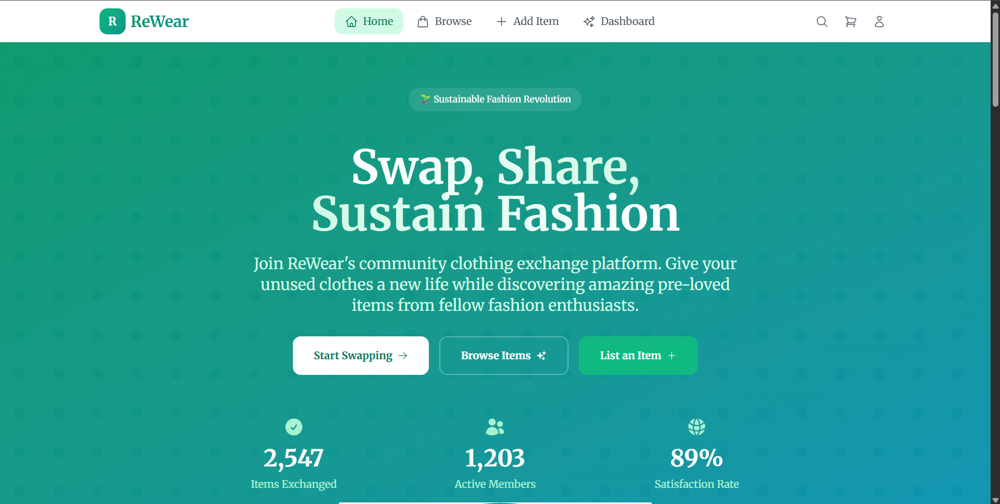
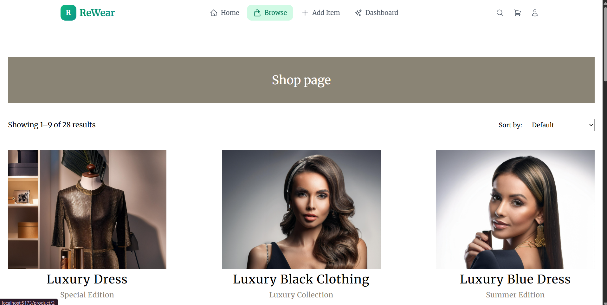
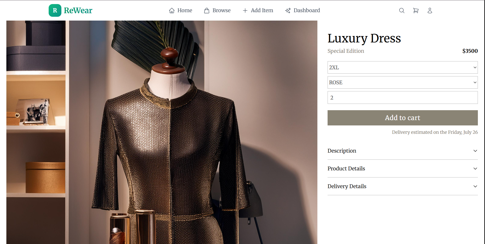
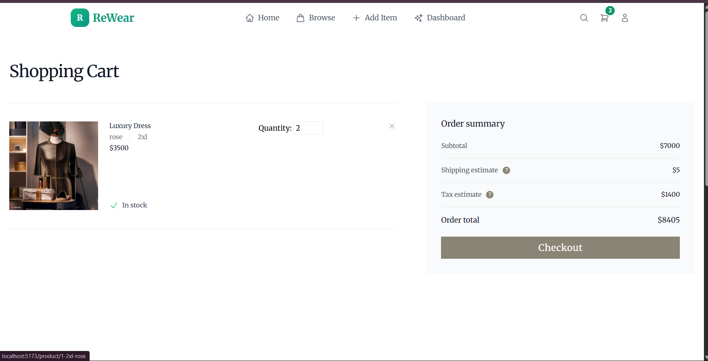
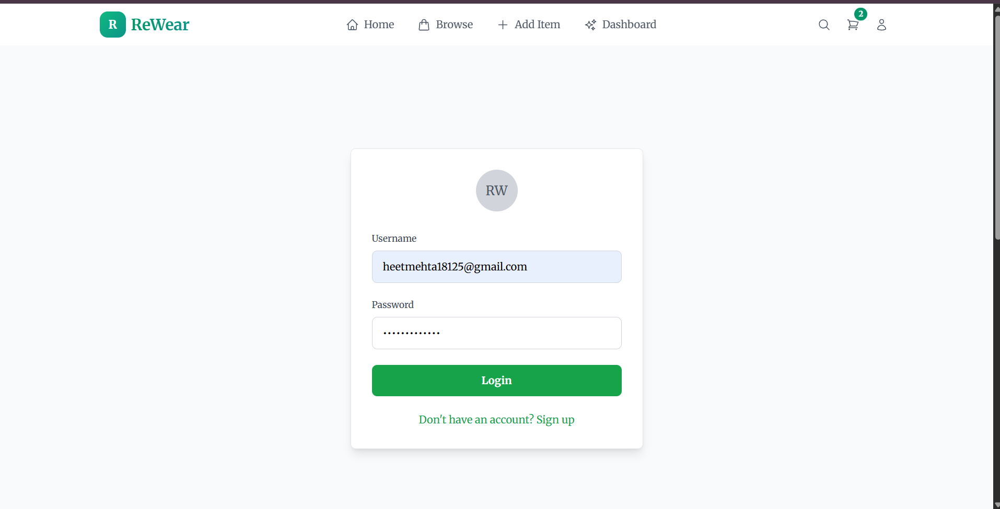
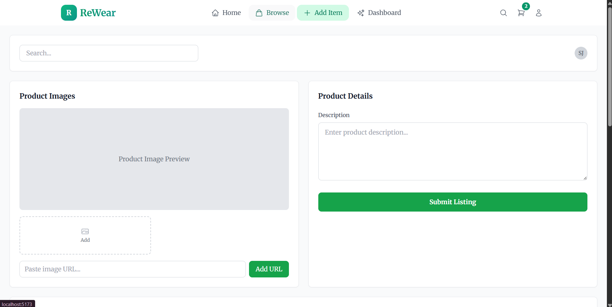

<h1>ReWare: Fashion eCommerce Template</h1>

<p>Fashion eCommerce template is a custom <b>fashion theme</b> completely designed and created from the ground up. The theme is designed in Figma by following foundational web design practices. <b>The fashion website template</b> was created using React.js best practices and techniques. The fashion website template is mainly a luxury fashion template for women, but it can also be used for men and kids. The fashion website template can also be used for any React eCommerce template or clothing eCommerce website. You can download it for free and test it yourself.</p>
<p>The following technologies were used in design and development:</p>
<ul>
  <li><p>Figma - The leading collaborative design tool for building meaningful products.</p></li>
  <li><p>React.js - Free and open-source front-end JavaScript library for building user interfaces based on components by Facebook Inc.</p></li>
  <li><p>TypeScript - Free and open-source high-level programming language developed by Microsoft that adds static typing with optional type annotations to JavaScript.</p></li>
  <li><p>JSON server - A lightweight and easy-to-use Node.js tool that simulates a RESTful API using a JSON file as the data source</p></li>
  <li><p>Redux Toolkit - The official, opinionated, batteries-included toolset for efficient Redux development</p></li>
  <li><p>Axios - Promise-based HTTP client for the browser and Node.js.</p></li>
  <li><p>React Router - A popular library for routing in React applications</p></li>
  <li><p>TailwindCSS - Utility-first CSS framework for rapidly building modern websites without ever leaving your HTML</p></li>
  <li><p>React hot toast - Beautiful notifications for React applications</p></li>
  <li><p>Concurrently - Package that allows you to run multiple scripts at the same time</p></li>
</ul>

<h2>Video instructions YouTube tutorial for running the application:
<a link src ="
https://drive.google.com/drive/folders/1yj0XIilFj_Lgtu8zxrbbpOV-wyF3PSDQ?usp=sharing">Link </a>

<h2>Instructions - The Fashion Website Template</h2>
<ol>
  <li><p>To run the app you first need to download and install Node.js and npm on your computer. Here is a link to the tutorial that explains how to install them: <a href="https://www.youtube.com/watch?v=4FAtFwKVhn0" target="_blank">https://www.youtube.com/watch?v=4FAtFwKVhn0</a>. Also here is the link where you can download them: <a href="https://nodejs.org/en" target="_blank">https://nodejs.org/en</a></p></li>
  <li><p>When you install all the programs you need on your computer you need to download the project. When you download the project, you need to extract it.</p></li>
  <li><p>After you extract the project, you need to open the project folder in the command prompt or any terminal of choice. After it write the following command:</p></li>
</ol>

```
npm install
```

<p>4. After everything is installed you need to write the following command:</p>

```
npm start
```

<h2>Project screenshots: </h2>

<h3>Landing page</h3>





<h3>Shop page</h3>




<h3>Single product page</h3>




<h3>Cart page</h3>



<h3>Login page</h3>



<h3>Add item page </h3>




Team Bash Scripters

Aryan Parikh - aryan81006@gmail.com
Urval Kheni - kheniurval@gmail.com
Heet Metha - heetmehta18125@gmail.com
Om Mistry - ommistry5559@gmail.com